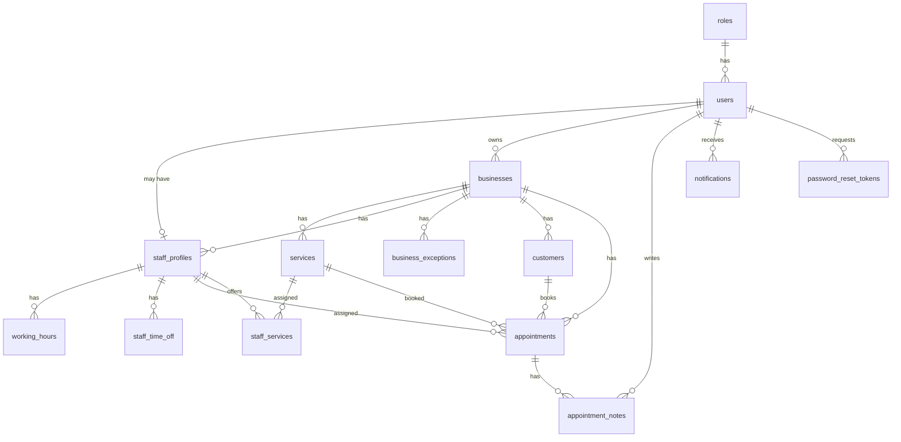

# ClientFlow MVP ERD

This document defines the first database design for the ClientFlow MVP. The goal is to support authentication, business setup, service/staff management, working hours, public booking, appointment workflow, customer history, notifications, and password reset.

## Scope

Included in MVP:

- users
- roles
- businesses
- services
- staff_profiles
- staff_services
- working_hours
- business_exceptions
- staff_time_off
- customers
- appointments
- appointment_notes
- notifications
- password_reset_tokens

Out of MVP:

- payments
- subscription_plans
- branches
- invoices
- audit_logs

## ERD

## Tables

### roles

Stores system roles used by Spring Security.

| Column | Type | Constraint | Notes |
| --- | --- | --- | --- |
| id | BIGINT | PK, auto increment | |
| name | VARCHAR(30) | NOT NULL, UNIQUE | OWNER, STAFF, CUSTOMER, ADMIN |
| description | VARCHAR(255) | NULL | Human-readable role description |
| created_at | DATETIME | NOT NULL | |
| updated_at | DATETIME | NOT NULL | |

### users

Stores login accounts. A user belongs to one role in the MVP.

| Column | Type | Constraint | Notes |
| --- | --- | --- | --- |
| id | BIGINT | PK, auto increment | |
| role_id | BIGINT | FK roles(id), NOT NULL | |
| full_name | VARCHAR(120) | NOT NULL | |
| email | VARCHAR(160) | NOT NULL, UNIQUE | Lowercase before saving |
| password_hash | VARCHAR(255) | NOT NULL | BCrypt |
| phone | VARCHAR(30) | NULL | |
| enabled | BOOLEAN | NOT NULL, DEFAULT TRUE | |
| created_at | DATETIME | NOT NULL | |
| updated_at | DATETIME | NOT NULL | |

Recommended indexes:

- UNIQUE(email)
- INDEX(role_id)

### businesses

Stores each service business/tenant. All owner-facing data must be isolated by business_id.

| Column | Type | Constraint | Notes |
| --- | --- | --- | --- |
| id | BIGINT | PK, auto increment | |
| owner_id | BIGINT | FK users(id), NOT NULL | Owner account |
| name | VARCHAR(160) | NOT NULL | |
| slug | VARCHAR(120) | NOT NULL, UNIQUE | Used in /booking/{slug} |
| phone | VARCHAR(30) | NULL | |
| email | VARCHAR(160) | NULL | |
| address | VARCHAR(255) | NULL | |
| timezone | VARCHAR(80) | NOT NULL | Default Asia/Ho_Chi_Minh |
| active | BOOLEAN | NOT NULL, DEFAULT TRUE | |
| created_at | DATETIME | NOT NULL | |
| updated_at | DATETIME | NOT NULL | |

Recommended indexes:

- UNIQUE(slug)
- INDEX(owner_id)

### services

Stores bookable services of a business.

| Column | Type | Constraint | Notes |
| --- | --- | --- | --- |
| id | BIGINT | PK, auto increment | |
| business_id | BIGINT | FK businesses(id), NOT NULL | |
| name | VARCHAR(140) | NOT NULL | |
| description | TEXT | NULL | |
| price | DECIMAL(12,2) | NOT NULL, DEFAULT 0 | Must be >= 0 |
| duration_minutes | INT | NOT NULL | Must be > 0 |
| active | BOOLEAN | NOT NULL, DEFAULT TRUE | Inactive services are hidden from public booking |
| created_at | DATETIME | NOT NULL | |
| updated_at | DATETIME | NOT NULL | |

Recommended indexes:

- INDEX(business_id)
- INDEX(business_id, active)

### staff_profiles

Stores staff information inside a business. A staff profile may be linked to a login user.

| Column | Type | Constraint | Notes |
| --- | --- | --- | --- |
| id | BIGINT | PK, auto increment | |
| business_id | BIGINT | FK businesses(id), NOT NULL | |
| user_id | BIGINT | FK users(id), NULL, UNIQUE | Nullable if owner creates staff before login access |
| display_name | VARCHAR(120) | NOT NULL | |
| email | VARCHAR(160) | NULL | |
| phone | VARCHAR(30) | NULL | |
| active | BOOLEAN | NOT NULL, DEFAULT TRUE | |
| created_at | DATETIME | NOT NULL | |
| updated_at | DATETIME | NOT NULL | |

Recommended indexes:

- INDEX(business_id)
- UNIQUE(user_id)

### staff_services

Join table for the many-to-many relation between staff and services.

| Column | Type | Constraint | Notes |
| --- | --- | --- | --- |
| staff_id | BIGINT | PK, FK staff_profiles(id) | |
| service_id | BIGINT | PK, FK services(id) | |
| created_at | DATETIME | NOT NULL | |

Recommended constraints:

- PRIMARY KEY(staff_id, service_id)
- INDEX(service_id)

### working_hours

Stores weekly working hours for each staff member.

| Column | Type | Constraint | Notes |
| --- | --- | --- | --- |
| id | BIGINT | PK, auto increment | |
| staff_id | BIGINT | FK staff_profiles(id), NOT NULL | |
| day_of_week | TINYINT | NOT NULL | 1=Monday, 7=Sunday |
| start_time | TIME | NOT NULL | |
| end_time | TIME | NOT NULL | Must be after start_time |
| active | BOOLEAN | NOT NULL, DEFAULT TRUE | |
| created_at | DATETIME | NOT NULL | |
| updated_at | DATETIME | NOT NULL | |

Recommended indexes:

- INDEX(staff_id, day_of_week, active)

### business_exceptions

Stores business-wide closed days or special closures.

| Column | Type | Constraint | Notes |
| --- | --- | --- | --- |
| id | BIGINT | PK, auto increment | |
| business_id | BIGINT | FK businesses(id), NOT NULL | |
| exception_date | DATE | NOT NULL | |
| type | VARCHAR(30) | NOT NULL | CLOSED_DAY, HOLIDAY, SPECIAL_CLOSURE |
| reason | VARCHAR(255) | NULL | |
| created_at | DATETIME | NOT NULL | |
| updated_at | DATETIME | NOT NULL | |

Recommended indexes:

- UNIQUE(business_id, exception_date)
- INDEX(business_id, exception_date)

### staff_time_off

Stores staff-specific unavailable time ranges.

| Column | Type | Constraint | Notes |
| --- | --- | --- | --- |
| id | BIGINT | PK, auto increment | |
| staff_id | BIGINT | FK staff_profiles(id), NOT NULL | |
| time_off_date | DATE | NOT NULL | |
| start_time | TIME | NULL | Null means full day |
| end_time | TIME | NULL | Null means full day |
| reason | VARCHAR(255) | NULL | |
| created_at | DATETIME | NOT NULL | |
| updated_at | DATETIME | NOT NULL | |

Recommended indexes:

- INDEX(staff_id, time_off_date)

### customers

Stores customers per business. The same email/phone can exist in different businesses.

| Column | Type | Constraint | Notes |
| --- | --- | --- | --- |
| id | BIGINT | PK, auto increment | |
| business_id | BIGINT | FK businesses(id), NOT NULL | |
| full_name | VARCHAR(120) | NOT NULL | |
| email | VARCHAR(160) | NULL | |
| phone | VARCHAR(30) | NOT NULL | |
| notes | TEXT | NULL | |
| created_at | DATETIME | NOT NULL | |
| updated_at | DATETIME | NOT NULL | |

Recommended indexes:

- INDEX(business_id)
- INDEX(business_id, phone)
- INDEX(business_id, email)

### appointments

Stores bookings. The public booking flow creates PENDING appointments by default.

| Column | Type | Constraint | Notes |
| --- | --- | --- | --- |
| id | BIGINT | PK, auto increment | |
| business_id | BIGINT | FK businesses(id), NOT NULL | |
| customer_id | BIGINT | FK customers(id), NOT NULL | |
| service_id | BIGINT | FK services(id), NOT NULL | |
| staff_id | BIGINT | FK staff_profiles(id), NOT NULL | |
| booking_code | VARCHAR(40) | NOT NULL, UNIQUE | Public reference code |
| appointment_date | DATE | NOT NULL | Stored in business timezone |
| start_time | TIME | NOT NULL | Stored in business timezone |
| end_time | TIME | NOT NULL | Stored in business timezone |
| status | VARCHAR(30) | NOT NULL | See booking rules |
| customer_note | TEXT | NULL | Note submitted by customer |
| cancel_reason | VARCHAR(255) | NULL | |
| completed_at | DATETIME | NULL | |
| created_at | DATETIME | NOT NULL | |
| updated_at | DATETIME | NOT NULL | |

Recommended indexes:

- UNIQUE(booking_code)
- INDEX(business_id, appointment_date)
- INDEX(staff_id, appointment_date, start_time, end_time)
- INDEX(business_id, status)
- INDEX(customer_id)
- INDEX(service_id)

Conflict rule:

- Only PENDING, CONFIRMED, and CHECKED_IN block a slot.
- CANCELLED, NO_SHOW, and COMPLETED do not block new future bookings.
- The application must re-check overlap inside a transaction when creating an appointment.

### appointment_notes

Stores internal notes added by owner or staff.

| Column | Type | Constraint | Notes |
| --- | --- | --- | --- |
| id | BIGINT | PK, auto increment | |
| appointment_id | BIGINT | FK appointments(id), NOT NULL | |
| author_id | BIGINT | FK users(id), NOT NULL | |
| note | TEXT | NOT NULL | |
| created_at | DATETIME | NOT NULL | |
| updated_at | DATETIME | NOT NULL | |

Recommended indexes:

- INDEX(appointment_id)
- INDEX(author_id)

### notifications

Stores in-app notification records. Sending real email/SMS is outside MVP.

| Column | Type | Constraint | Notes |
| --- | --- | --- | --- |
| id | BIGINT | PK, auto increment | |
| business_id | BIGINT | FK businesses(id), NOT NULL | |
| recipient_user_id | BIGINT | FK users(id), NULL | Nullable for business-level notification |
| appointment_id | BIGINT | FK appointments(id), NULL | |
| type | VARCHAR(50) | NOT NULL | See booking rules |
| title | VARCHAR(160) | NOT NULL | |
| message | TEXT | NULL | |
| read_at | DATETIME | NULL | |
| created_at | DATETIME | NOT NULL | |
| updated_at | DATETIME | NOT NULL | |

Recommended indexes:

- INDEX(business_id, created_at)
- INDEX(recipient_user_id, read_at)
- INDEX(appointment_id)

### password_reset_tokens

Stores one-time reset tokens.

| Column | Type | Constraint | Notes |
| --- | --- | --- | --- |
| id | BIGINT | PK, auto increment | |
| user_id | BIGINT | FK users(id), NOT NULL | |
| token_hash | VARCHAR(255) | NOT NULL, UNIQUE | Store hash, not raw token |
| expires_at | DATETIME | NOT NULL | Expires after 15 minutes |
| used_at | DATETIME | NULL | Null means unused |
| created_at | DATETIME | NOT NULL | |
| updated_at | DATETIME | NOT NULL | |

Recommended indexes:

- UNIQUE(token_hash)
- INDEX(user_id)
- INDEX(expires_at)

## Data Isolation Rules

- Every owner-facing query must be filtered by business_id.
- A business owner can only manage businesses where businesses.owner_id equals their user id.
- Staff can only see appointments assigned to their staff profile.
- Public booking endpoints only expose active business, active services, active staff, and available slots.

## Implementation Notes

- Use BIGINT auto increment ids for simplicity.
- Use DATETIME for audit timestamps and business-local date/time fields for appointments.
- Use DATE + TIME for booking time because the MVP uses one fixed business timezone, Asia/Ho_Chi_Minh.
- Keep business.timezone even though the MVP default is fixed. This prevents a painful migration later.
- Prefer soft deactivation for services and staff. Do not hard-delete a service if appointments already reference it.
